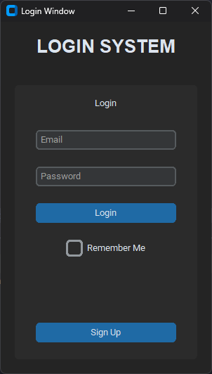
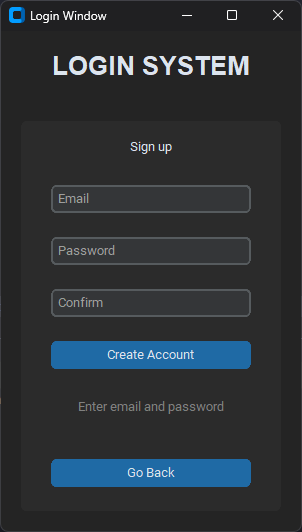

## LOGIN SYSTEM

This README provides an overview of the **Login System** - a Python application for user authentication 
and registration using the **customtkinter** library for the graphical user interface and SQLite for database interaction.

## **Introduction**

The Login System app is designed to create a user-friendly GUI for user authentication and registration. 
It offers features for logging in, signing up, and adding new users to an SQLite database. 
The app is built on top of the **tkinter** library and uses the custom **customtkinter** module for enhanced UI elements.

## Look and feel

## **Installation**

### SOURCE:

Clone the repository:  
`git clone https://github.com/paichiwo/login-system.git`

Install the required dependencies or run `requirements.txt`:  
`pip install customtkinter`  
or  
`pip install -r requirements.txt`

Run the application:  
`python main.py`

## **Usage**

1.  Launch the application using the provided installation steps.
2.  The application opens with a login window where users can enter their email and password.
3.  Click the "Login" button to attempt to log in.
4.  If the user does not have an account, they can click the "Sign Up" button to create a new account.
5.  Upon clicking the "Sign Up" button, the registration window will appear, prompting users to enter their email and desired password.
6.  After entering the required information, users can click the "Create Account" button to add their details to the database.
7.  If successful, a success message will be displayed, and users can return to the login window using the "Go Back" button.
8.  Upon successful login, a message will be shown in a 'test' target application window.

## **Contributing**

Contributions to this project are welcome. To contribute, follow these steps:

1.  Fork the repository.
2.  Create a new branch for your feature: **git checkout -b feature-name**.
3.  Make your changes and commit them: **git commit -m 'Add some feature'**.
4.  Push to the branch: **git push origin feature-name**.
5.  Open a pull request.

## **License**

This project is licensed under the [MIT License](LICENSE). Feel free to modify and distribute it according to the terms of the license.